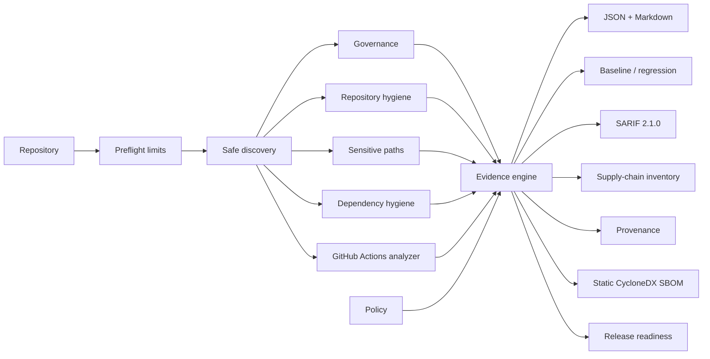
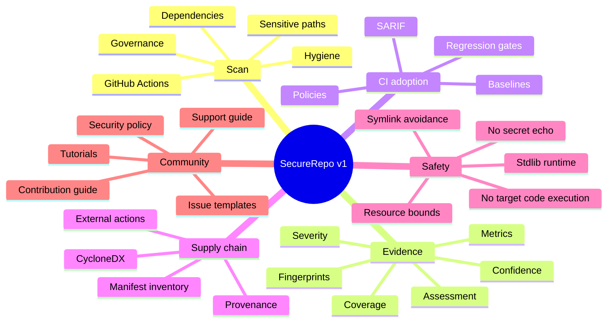

<div align="center">

# 🔐 DkWess SecureRepo

### Evidence-oriented repository security, governance, CI and supply-chain auditing

[](https://github.com/DKWesley13/DkWess/actions/workflows/ci.yml)


**`PASS != SECURITY GUARANTEE`**

[🚀 Start](#-quick-start) · [🧭 Purpose](#-what-it-does) · [🧰 Commands](#-command-reference) · [📊 Evidence](#-evidence-model) · [🏗 Architecture](#-architecture) · [📚 Docs](#-documentation) · [🇧🇷 Português](README.pt-BR.md)

</div>

---

> [!IMPORTANT]
> SecureRepo v1.0.0 is a **technically stable public-source milestone**. A software license has not yet been selected, so general reuse/redistribution permission is still a separate legal gate. See [License status](#%EF%B8%8F-license-status).

## ✨ What is SecureRepo?

**DkWess SecureRepo** is a local-first Python CLI/library that inspects a repository and produces reviewable security/governance evidence **without executing the target project's code**.

It is for maintainers, developers and teams that want a transparent first-pass answer to two different questions:

1. **What did the implemented checks find?**
2. **What did this version actually assess?**

That second question matters because “nothing triggered” is not the same as “everything is secure”.

## 🧭 What it does

| Area | v1 capability |
|---|---|
| 📘 Governance | README, SECURITY, CONTRIBUTING and license-presence checks |
| 🧹 Repository hygiene | `.gitignore`, discovery completeness, symlink-safe traversal |
| 🔐 Sensitive paths | secret/key filenames and credential-adjacent configuration paths without echoing secret contents |
| 📦 Dependency hygiene | common manifests plus selected Node.js/Go lockfile checks |
| ⚙️ GitHub Actions | privileged triggers, broad permissions, persisted credentials, mutable actions, self-hosted runners, selected shell hazards and Docker pinning |
| 🧾 Evidence | severity, confidence, stable fingerprints, scan metrics, assessment and coverage states |
| 🧱 Baselines | known-finding snapshots and regression-only gates |
| 🔗 Supply chain | local manifest/action inventory and credential-redacted Git provenance |
| 🛰 SARIF | SARIF 2.1.0 export for code-scanning consumers |
| 🧬 SBOM | best-effort CycloneDX 1.5 static dependency inventory |
| 🧩 Policy | TOML/JSON thresholds, coverage requirements and explicit suppressions |
| 🛡 Hardening | file/workflow resource bounds and cross-platform CI |
| ✅ Release readiness | separate technical-readiness and license/reuse gates |

### What it does **not** claim

SecureRepo is not a penetration-testing engine, malware detector, complete secret-content scanner, full SAST engine, online vulnerability database client, legal-license analyzer or proof that software is secure. Unsupported or unassessed areas stay explicit.

## 🚀 Quick start

### Requirements

- Python **3.11+**
- Git recommended
- Windows, Linux or macOS
- no third-party Python runtime package required

### Windows PowerShell

```powershell
git clone https://github.com/DKWesley13/DkWess.git
cd DkWess
py -m venv .venv
.\.venv\Scripts\Activate.ps1
python -m pip install -e .
dkwess-securerepo --version
dkwess-securerepo .
```

### Linux / macOS

```bash
git clone https://github.com/DKWesley13/DkWess.git
cd DkWess
python3 -m venv .venv
source .venv/bin/activate
python -m pip install -e .
dkwess-securerepo --version
dkwess-securerepo .
```

Expected version:

```text
dkwess-securerepo 1.0.0
```

Default evidence files:

```text
reports/audit.json
reports/audit.md
```

## 🧪 A useful first session

```bash
# See available rules
dkwess-securerepo --list-checks

# Understand one rule
dkwess-securerepo --explain SR-GHA-010

# Audit a repository
dkwess-securerepo /path/to/repository

# Fail CI at MEDIUM+
dkwess-securerepo . --fail-on MEDIUM

# Require all implemented capabilities to be fully assessable
dkwess-securerepo . --require-full-coverage

# See scanner resource bounds
dkwess-securerepo --show-limits
```

## 🧱 Baseline + regression workflow

A baseline records known findings; it **does not turn them into PASS**.

```bash
# First reviewed snapshot
dkwess-securerepo . --write-baseline .securerepo-baseline.json

# Later: show new/resolved/unchanged
dkwess-securerepo . --compare-baseline .securerepo-baseline.json

# CI gate only on new HIGH+ findings
dkwess-securerepo . \
  --compare-baseline .securerepo-baseline.json \
  --fail-on HIGH \
  --fail-on-new
```

Regression exit code is `4`.

## 🔗 Supply-chain, provenance, SARIF and SBOM

```bash
dkwess-securerepo . \
  --supply-chain reports/supply-chain.json \
  --provenance reports/provenance.json \
  --sarif reports/securerepo.sarif \
  --sbom reports/sbom.cdx.json
```

These are **local static evidence outputs**. SecureRepo does not silently upload them or query external vulnerability services.

## 🧩 Policy engine

Create `securerepo.toml`:

```toml
[policy]
fail_on = "HIGH"
require_full_coverage = false

disabled_rules = []
exclude_paths = []
allow_critical_suppression = false
```

Run:

```bash
dkwess-securerepo . --policy securerepo.toml
```

Suppressions are explicitly counted. CRITICAL rules cannot be disabled unless the policy deliberately enables `allow_critical_suppression = true`.

## ✅ Release readiness

```bash
dkwess-securerepo . --release-check
```

The check separates:

- **technical readiness**: version, required public documentation, no non-license findings, implemented capabilities fully covered;
- **open-source reuse readiness**: technical readiness **plus an explicit license file**.

This repository can therefore report `technical_ready: true` while correctly reporting `open_source_reuse_ready: false` until the maintainer selects a license.

## 📊 Evidence model

### Assessment

| State | Meaning |
|---|---|
| `PASS` | implemented checks completed without findings |
| `FAIL` | one or more implemented checks produced findings |
| `BLOCKED` | the scanner attempted the capability but could not complete it |
| `NOT_ASSESSED` | no meaningful conclusion is made |

### Coverage

| State | Meaning |
|---|---|
| `FULL` | implemented checks for the capability completed |
| `PARTIAL` | only part of implemented coverage completed |
| `UNKNOWN` | SecureRepo does not claim meaningful coverage |

Every finding carries a stable rule ID, severity, confidence, category, path, remediation and short fingerprint.

## ⚙️ GitHub Actions Analyzer

Built-in rules currently cover:

- `pull_request_target` review;
- `permissions: write-all`;
- checkout `persist-credentials: true`;
- remote actions with no reference;
- remote actions not pinned to a full 40-character SHA;
- self-hosted runner review;
- selected user-controlled GitHub contexts interpolated directly into shell commands;
- selected `curl`/`wget` pipe-to-shell patterns;
- Docker actions without `sha256` digest pinning;
- CRITICAL `pull_request_target` + pull-request-head-content combinations.

Use `--list-checks` and `--explain RULE_ID` for the authoritative built-in catalog.

## 🏗 Architecture



## 🧠 Project map



## 🧰 Command reference

| Option | Purpose |
|---|---|
| `PATH` | repository to audit; default `.` |
| `--output DIR` | write default Markdown/JSON reports |
| `--fail-on LEVEL` | fail at selected severity |
| `--require-full-coverage` | fail when implemented capability coverage is incomplete |
| `--policy FILE` | TOML/JSON policy |
| `--write-baseline FILE` | create known-findings snapshot |
| `--compare-baseline FILE` | compare with snapshot |
| `--fail-on-new` | gate only newly introduced findings |
| `--supply-chain FILE` | component/action inventory |
| `--provenance FILE` | local Git/manifests provenance |
| `--sarif FILE` | SARIF 2.1.0 export |
| `--sbom FILE` | CycloneDX 1.5 static inventory |
| `--release-check` | evaluate v1 technical + license gates |
| `--list-checks` | list rules |
| `--explain ID` | explain rule |
| `--show-limits` | show resource bounds |
| `--json-stdout` | machine-readable stdout |
| `--no-reports` | skip default audit files |
| `--version` | show package version |

Exit codes: `0` successful under selected gate, `1` runtime/config error, `2` finding threshold, `3` strict coverage, `4` baseline regression, `5` technical release-readiness blocker.

## 🛡 Hardening

The public scan API performs a preflight with explicit limits before scanning. Recursive discovery does not follow symlinks. Current CI executes compilation, unit tests, CLI smoke tests and self-audit on **Ubuntu, macOS and Windows**.

See [`docs/HARDENING.md`](docs/HARDENING.md) and [`docs/COMPATIBILITY.md`](docs/COMPATIBILITY.md).

## 📚 Documentation

| Guide | Purpose |
|---|---|
| [`GETTING_STARTED`](docs/GETTING_STARTED.md) | install and first audit |
| [`USAGE`](docs/USAGE.md) | practical CLI recipes |
| [`CHECKS`](docs/CHECKS.md) | built-in rule catalog |
| [`BASELINES`](docs/BASELINES.md) | regression workflow |
| [`SUPPLY_CHAIN`](docs/SUPPLY_CHAIN.md) | inventory + provenance |
| [`SARIF`](docs/SARIF.md) | SARIF export |
| [`SBOM`](docs/SBOM.md) | CycloneDX inventory |
| [`POLICY`](docs/POLICY.md) | policy engine |
| [`ARCHITECTURE`](docs/ARCHITECTURE.md) | design / trust boundaries |
| [`AUDIT_METHODOLOGY`](docs/AUDIT_METHODOLOGY.md) | evidence philosophy |
| [`THREAT_MODEL`](docs/THREAT_MODEL.md) | threats and non-goals |
| [`HARDENING`](docs/HARDENING.md) | resource bounds |
| [`COMPATIBILITY`](docs/COMPATIBILITY.md) | platforms |
| [`V1_AUDIT`](docs/V1_AUDIT.md) | v1 technical closure |
| [`RELEASE_CHECKLIST`](docs/RELEASE_CHECKLIST.md) | release gates |

Community documents: [`CONTRIBUTING.md`](CONTRIBUTING.md), [`SECURITY.md`](SECURITY.md), [`SUPPORT.md`](SUPPORT.md), [`CODE_OF_CONDUCT.md`](CODE_OF_CONDUCT.md).

## 🤝 Contributing

New checks should have a stable rule ID, category, severity, confidence, evidence behavior, remediation, tests and documented limitations. Security reports should follow [`SECURITY.md`](SECURITY.md), not public exploit disclosure.

## ⚖️ License status

A software license has **not yet been selected**.

> [!WARNING]
> Public visibility alone does not grant general reuse or redistribution rights. v1.0.0 marks technical/API stability, not completion of the legal open-source reuse gate. The maintainer must explicitly choose a license before this project should be described as fully open source and generally reusable under license terms.

---

<div align="center">

### 🔎 Measure what was assessed. Never hide what was not.

**DkWess SecureRepo v1.0.0**

</div>
