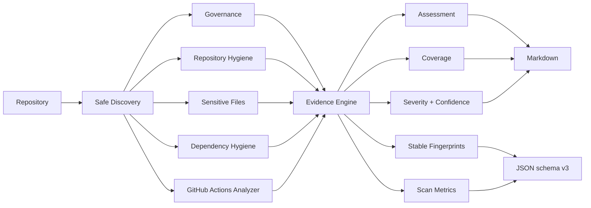
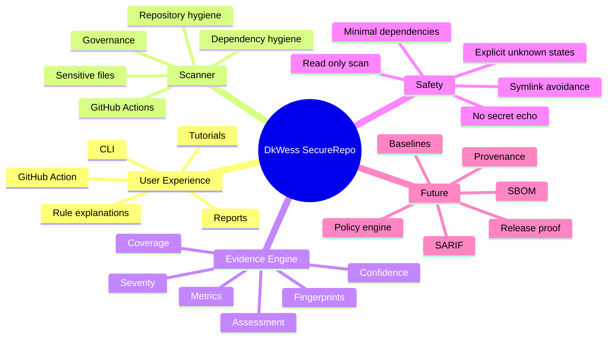

<div align="center">

# 🔐 DkWess SecureRepo

### Evidence-oriented repository security, governance and GitHub Actions auditing

[](https://github.com/DKWesley13/DkWess/actions/workflows/ci.yml)


**`PASS != SECURITY GUARANTEE`**

[🚀 Quick start](#-quick-start) · [🧭 What it does](#-what-it-does) · [🧰 Commands](#-command-reference) · [🏗 Architecture](#-architecture) · [📚 Docs](#-documentation) · [🇧🇷 Português](README.pt-BR.md)

</div>

---

> [!NOTE]
> SecureRepo is an early public project. It is designed to produce **reviewable evidence**, not to claim that a repository is completely secure.

**DkWess SecureRepo** is a local-first Python tool for developers, maintainers and teams who want a fast, transparent first-pass audit of a software repository.

It currently reviews:

- 📘 repository governance files;
- 🧹 repository hygiene and `.gitignore` coverage;
- 🔑 potentially sensitive filenames and credential-adjacent configuration;
- 📦 dependency manifests and selected lockfile hygiene;
- ⚙️ GitHub Actions workflow risk patterns;
- 📊 assessment state, coverage state, severity and confidence;
- 🧾 Markdown and JSON evidence reports.

SecureRepo is deliberately conservative: an area that was not meaningfully assessed should not silently become a green checkmark.

## 🌟 Why this project is different

Many tools answer only: **“Did a rule trigger?”**

SecureRepo also asks: **“What was actually assessed, and how complete was the implemented coverage?”**

| Assessment | Meaning |
|---|---|
| `PASS` | Implemented checks completed without findings |
| `FAIL` | One or more implemented checks produced findings |
| `BLOCKED` | The scanner attempted the capability but could not complete it |
| `NOT_ASSESSED` | No meaningful conclusion is made for that capability |

| Coverage | Meaning |
|---|---|
| `FULL` | The implemented checks for the capability completed |
| `PARTIAL` | Only part of the implemented checks completed |
| `UNKNOWN` | SecureRepo does not claim meaningful coverage |

## 🧭 What it does

### 🛡️ Governance
Checks for `README.md`, `SECURITY.md`, `CONTRIBUTING.md`, and a recognized license file.

### 🧹 Repository hygiene
Reviews `.gitignore`, discovery completeness, and skips symbolic links during recursive discovery.

### 🔐 Sensitive filenames
Looks for filenames and paths commonly associated with secrets, key material, package-manager credentials, cloud credentials and similar configuration.

> [!IMPORTANT]
> The filename/path checks **do not read or print secret contents**.

### 📦 Dependency hygiene
Inventories common Python, Node.js, Go, Rust, Ruby, PHP, Maven and Gradle manifests. Version `0.0.3` adds selected Node.js and Go lockfile checks.

### ⚙️ GitHub Actions Analyzer V2
Current checks include `pull_request_target`, `permissions: write-all`, persisted checkout credentials, mutable action references, self-hosted runners, selected shell-injection context patterns, selected remote pipe-to-shell patterns, Docker action digest pinning, and dangerous `pull_request_target` + pull-request-head combinations.

## 🚀 Quick start

### Requirements
- Python **3.11 or newer**
- Git recommended
- no third-party Python package required at runtime

### 1. Clone
```bash
git clone https://github.com/DKWesley13/DkWess.git
cd DkWess
```

### 2. Install

#### Windows PowerShell
```powershell
py -m venv .venv
.\.venv\Scripts\Activate.ps1
python -m pip install -e .
```

#### Linux / macOS
```bash
python3 -m venv .venv
source .venv/bin/activate
python -m pip install -e .
```

### 3. Confirm
```bash
dkwess-securerepo --version
```

Expected:
```text
dkwess-securerepo 0.0.3
```

### 4. Audit
```bash
dkwess-securerepo .
```

Windows example:
```powershell
dkwess-securerepo "C:\Projects\my-app"
```

Default reports:
```text
reports/audit.json
reports/audit.md
```

## 🧪 First five commands to try
```bash
dkwess-securerepo --version
dkwess-securerepo --list-checks
dkwess-securerepo --explain SR-GHA-007
dkwess-securerepo .
dkwess-securerepo . --fail-on MEDIUM
```

## 🧰 Command reference

| Option | Purpose |
|---|---|
| `PATH` | repository to scan; defaults to `.` |
| `--output DIR` | report directory; defaults to `reports` |
| `--fail-on LEVEL` | exit `2` when a finding reaches the threshold |
| `--require-full-coverage` | exit `3` if any capability is `PARTIAL` or `UNKNOWN` |
| `--no-reports` | do not create report files |
| `--json-stdout` | emit only JSON to stdout |
| `--list-checks` | list all built-in rules |
| `--explain RULE_ID` | explain one rule and remediation |
| `--version` | show version |

Exit codes: `0` success under policy, `1` runtime/config error, `2` finding threshold reached, `3` strict coverage not achieved.

## 🧭 Example output
```text
DkWess SecureRepo v0.0.3
Status: REVIEW_REQUIRED
Findings: 1
CRITICAL: 0 | HIGH: 0 | MEDIUM: 1 | LOW: 0 | INFO: 0
Discovery: 34 files | 1 workflows | 1 manifests | 0 symlinks skipped
Implemented capability coverage: 100%
Capabilities:
  Governance: FAIL / FULL (1 findings)
  Repository Hygiene: PASS / FULL (0 findings)
  Sensitive Filenames: PASS / FULL (0 findings)
  Dependency Inventory: PASS / FULL (0 findings)
  GitHub Actions: PASS / FULL (0 findings)
Reports: reports/audit.json, reports/audit.md
PASS != SECURITY GUARANTEE
```

## 📊 Capabilities

| Capability | v0.0.3 |
|---|---|
| Governance files | ✅ Available |
| `.gitignore` hygiene | ✅ Available |
| Symlink-safe discovery | ✅ Available |
| Sensitive filename/path review | ✅ Available |
| Dependency manifest inventory | ✅ Available |
| Node/Go lockfile hygiene | ✅ Available |
| GitHub Actions Analyzer V2 | ✅ Available |
| Severity + confidence | ✅ Available |
| Stable finding fingerprint | ✅ Available |
| Assessment + coverage state | ✅ Available |
| Scan metrics | ✅ Available |
| Markdown + JSON schema v3 | ✅ Available |
| GitHub composite action | ✅ Available |
| Known-findings baseline | 🛠 Planned |
| SARIF / Code Scanning | 🛠 Planned |
| SBOM | 🛠 Planned |
| Provenance / upstream drift | 🛠 Planned |
| Policy engine | 🛠 Planned |

## 🤖 GitHub Actions
This repository contains a root `action.yml`. For security, pin external actions to reviewed **full commit SHAs** rather than mutable branches/tags.

```yaml
permissions:
  contents: read

steps:
  - uses: actions/checkout@<FULL_COMMIT_SHA>
    with:
      persist-credentials: false

  - name: Audit repository with SecureRepo
    uses: DKWesley13/DkWess@<FULL_SECURE_REPO_COMMIT_SHA>
    with:
      path: .
      fail-on: HIGH
      output: reports
```

See [`docs/GITHUB_ACTIONS.md`](docs/GITHUB_ACTIONS.md).

## 🔎 Understand a finding
```bash
dkwess-securerepo --explain SR-GHA-007
```
Each JSON finding includes a stable short fingerprint designed for the future baseline engine.

## 🏗 Architecture


## 🧠 Project mind map


## 📄 Report schema
Schema v3 adds tool version, scan metrics, coverage percent and stable finding fingerprints. See [`docs/REPORT_SCHEMA.md`](docs/REPORT_SCHEMA.md).

## 🧪 Development
```bash
python -m compileall -q src
PYTHONPATH=src python -m unittest discover -s tests -v
PYTHONPATH=src python -m dkwess_securerepo --version
PYTHONPATH=src python -m dkwess_securerepo --list-checks
PYTHONPATH=src python -m dkwess_securerepo . --output reports --fail-on HIGH
```

## 📚 Documentation

| Document | Purpose |
|---|---|
| [`docs/GETTING_STARTED.md`](docs/GETTING_STARTED.md) | complete installation + first audit |
| [`docs/USAGE.md`](docs/USAGE.md) | CLI recipes |
| [`docs/GITHUB_ACTIONS.md`](docs/GITHUB_ACTIONS.md) | CI integration |
| [`docs/AUDIT_METHODOLOGY.md`](docs/AUDIT_METHODOLOGY.md) | evidence methodology |
| [`docs/ARCHITECTURE.md`](docs/ARCHITECTURE.md) | design and trust boundaries |
| [`docs/PROJECT_MAP.md`](docs/PROJECT_MAP.md) | visual project map |
| [`docs/CHECKS.md`](docs/CHECKS.md) | rule catalog |
| [`docs/REPORT_SCHEMA.md`](docs/REPORT_SCHEMA.md) | report contract |
| [`docs/THREAT_MODEL.md`](docs/THREAT_MODEL.md) | threat model |
| [`docs/ROADMAP.md`](docs/ROADMAP.md) | staged plan |
| [`docs/FAQ.md`](docs/FAQ.md) | troubleshooting |
| [`docs/RELEASE_CHECKLIST.md`](docs/RELEASE_CHECKLIST.md) | release gates |
| [`SECURITY.md`](SECURITY.md) | vulnerability reporting |
| [`CONTRIBUTING.md`](CONTRIBUTING.md) | contributor workflow |
| [`SUPPORT.md`](SUPPORT.md) | help path |

## 🧩 Principles
1. Evidence over claims.
2. Unknown is not PASS.
3. Coverage is explicit.
4. Do not echo secret contents.
5. Do not follow symlinks during recursive discovery.
6. Read target repositories; write only reports.
7. Prefer deterministic, explainable evidence.
8. Keep runtime authority/dependencies small.
9. Document limitations.
10. `PASS != SECURITY GUARANTEE`.

## 🗺 Road to 1.0
```text
0.0.3  Public usability + GitHub Actions Analyzer V2   ← current
0.0.4  Known-findings baseline + regression gate
0.0.5  Supply-chain + provenance
0.0.6  SARIF + GitHub Code Scanning
0.0.7  SBOM support
0.0.8  Policy engine
0.0.9  UX, packaging and adversarial hardening
1.0.0  Audited stable public release
```

The earlier `0.2.0` repository milestone was development-phase numbering. `0.0.3` establishes the maintainer-requested public incubation sequence before 1.0.

## 🤝 Contributing
Read [`CONTRIBUTING.md`](CONTRIBUTING.md). New checks should include a stable ID, category, severity, confidence, evidence behavior, remediation, tests and documented limitations.

## ⚖️ License status
A software license has **not yet been selected**.

> [!WARNING]
> Public visibility alone does not grant general reuse or redistribution rights. License selection remains the final legal/public-reuse blocker before calling the project fully open source.

---

<div align="center">

### 🔎 Measure what was assessed. Never hide what was not.

</div>
