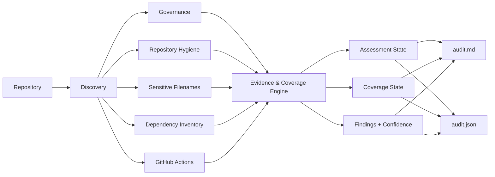
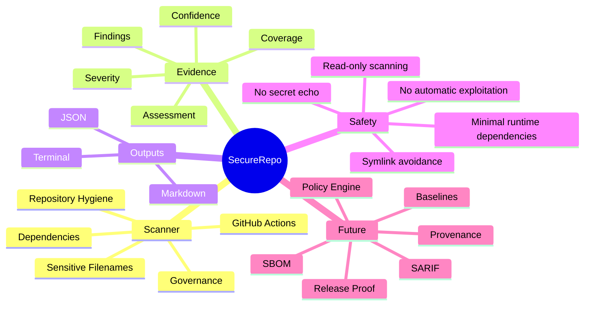

<div align="center">

# 🔐 DkWess SecureRepo

**Evidence-oriented repository security, governance and GitHub Actions auditing.**

[](https://github.com/DKWesley13/DkWess/actions/workflows/ci.yml)


**`PASS != SECURITY GUARANTEE`**

[Quick start](#-quick-start) · [Capabilities](#-capabilities) · [Architecture](#-architecture) · [Docs](#-documentation) · [Roadmap](docs/ROADMAP.md)

</div>

---

SecureRepo is a dependency-light Python toolkit that audits a repository and produces structured evidence about **governance, repository hygiene, sensitive filenames, dependency manifests and GitHub Actions risk patterns**.

It is designed for developers, maintainers and teams who want a fast, transparent first-pass audit that can run locally or in CI without silently turning unknown areas into a green checkmark.

## ✨ Why SecureRepo?

Many scanners answer only one question: *"Did a rule trigger?"*

SecureRepo is evolving toward a second question that is just as important:

> **"How much of this area was actually assessed?"**

Version `0.2.0` introduces the first **Evidence & Coverage Engine**, separating:

| Assessment | Meaning |
|---|---|
| `PASS` | Implemented checks completed without findings for that capability |
| `FAIL` | Implemented checks produced one or more findings |
| `BLOCKED` | The scanner attempted the capability but could not fully assess it |
| `NOT_ASSESSED` | The capability did not apply or could not be meaningfully evaluated |

and:

| Coverage | Meaning |
|---|---|
| `FULL` | The implemented checks for that capability completed |
| `PARTIAL` | Only part of the capability could be assessed |
| `UNKNOWN` | No meaningful coverage claim is made |

This avoids treating **absence of evidence as evidence of security**.

## 🚀 Quick start

SecureRepo requires Python 3.11+ and uses only the Python standard library at runtime.

```bash
python -m pip install -e .
dkwess-securerepo .
```

Without installing:

```bash
PYTHONPATH=src python -m dkwess_securerepo .
```

PowerShell:

```powershell
$env:PYTHONPATH = "src"
python -m dkwess_securerepo .
```

Default reports:

```text
reports/audit.json
reports/audit.md
```

Use a stricter CI threshold:

```bash
dkwess-securerepo . --fail-on MEDIUM
```

Exit codes:

| Code | Meaning |
|---:|---|
| `0` | No finding met the selected failure threshold |
| `1` | Tool/runtime error |
| `2` | A finding met or exceeded the selected threshold |

## 🧭 Example console output

```text
DkWess SecureRepo
Status: REVIEW_REQUIRED
Findings: 1
CRITICAL: 0 | HIGH: 0 | MEDIUM: 1 | LOW: 0 | INFO: 0
Capabilities:
  Governance: FAIL / FULL (1 findings)
  Repository Hygiene: PASS / FULL (0 findings)
  Sensitive Filenames: PASS / FULL (0 findings)
  Dependency Inventory: PASS / FULL (0 findings)
  GitHub Actions: PASS / FULL (0 findings)
Reports: reports/audit.json, reports/audit.md
PASS != SECURITY GUARANTEE
```

## 🛡️ Capabilities

| Capability | V0.2 |
|---|---|
| Governance files | ✅ |
| `.gitignore` hygiene | ✅ |
| Potentially sensitive filenames | ✅ |
| Dependency manifest inventory | ✅ |
| GitHub Actions risk heuristics | ✅ |
| Finding severity | ✅ |
| Finding confidence | ✅ |
| Capability assessment state | ✅ |
| Coverage state | ✅ |
| Markdown reports | ✅ |
| JSON schema v2 | ✅ |
| Symlink-safe file walk | ✅ |
| Known findings baseline | 🛠 Planned |
| SARIF / GitHub Code Scanning | 🛠 Planned |
| SBOM | 🛠 Planned |
| Provenance / upstream drift | 🛠 Planned |
| Policy engine | 🛠 Planned |

The exact rules and limitations are documented in [`docs/CHECKS.md`](docs/CHECKS.md).

## 🏗️ Architecture



The detailed design lives in [`docs/ARCHITECTURE.md`](docs/ARCHITECTURE.md).

## 🧠 Project map



## 🔎 GitHub Actions checks

V0.2 currently detects conservative patterns including:

- `pull_request_target`;
- `permissions: write-all`;
- `persist-credentials: true`;
- remote actions with no `@ref`;
- remote actions not pinned to a full 40-character commit SHA.

The workflow analyzer is intentionally **line-oriented and conservative**. It is not a complete YAML semantic engine. This limitation is documented rather than hidden.

## 🔐 Sensitive-file behavior

SecureRepo checks names and extensions commonly associated with sensitive material, including `.env`, private-key-style filenames, and selected key/certificate extensions.

For this capability, SecureRepo **does not read or print file contents**. A filename match is a review signal, not proof that a real secret exists.

The repository walker also skips symbolic links rather than following them during recursive discovery.

## 📊 Reports

JSON report schema `2` includes:

```json
{
  "schema_version": 2,
  "status": "REVIEW_REQUIRED",
  "security_guarantee": false,
  "statement": "PASS != SECURITY GUARANTEE",
  "capabilities": [
    {
      "capability": "GitHub Actions",
      "assessment": "PASS",
      "coverage": "FULL",
      "finding_count": 0
    }
  ],
  "findings": []
}
```

See [`docs/REPORT_SCHEMA.md`](docs/REPORT_SCHEMA.md) for the full contract.

## 🧪 Development

```bash
PYTHONPATH=src python -m unittest discover -s tests -v
PYTHONPATH=src python -m dkwess_securerepo . --output reports --fail-on HIGH
```

The CI pipeline runs both the unit-test suite and a SecureRepo self-audit.

## 📚 Documentation

| Document | Purpose |
|---|---|
| [`docs/ARCHITECTURE.md`](docs/ARCHITECTURE.md) | system design and trust boundaries |
| [`docs/CHECKS.md`](docs/CHECKS.md) | implemented checks and limitations |
| [`docs/REPORT_SCHEMA.md`](docs/REPORT_SCHEMA.md) | JSON/report contract |
| [`docs/THREAT_MODEL.md`](docs/THREAT_MODEL.md) | threat model and non-goals |
| [`docs/ROADMAP.md`](docs/ROADMAP.md) | staged path toward a public 1.0 |
| [`SECURITY.md`](SECURITY.md) | vulnerability reporting policy |
| [`CONTRIBUTING.md`](CONTRIBUTING.md) | contribution expectations |

## 🧩 Design principles

1. **Evidence over claims.**
2. **Unknown is not PASS.**
3. **Coverage is explicit.**
4. **Findings never echo secret contents.**
5. **Scanner behavior is read-only apart from its report directory.**
6. **Runtime dependencies stay minimal.**
7. **`PASS != SECURITY GUARANTEE`.**

## 🗺️ Road to 1.0

The project is intentionally still **alpha**. The roadmap targets staged releases rather than claiming production maturity early.

```text
0.2  Evidence + coverage foundation      ← current
0.3  GitHub Actions analyzer V2
0.4  Known-findings baseline engine
0.5  Supply-chain + provenance
0.6  SARIF + GitHub Code Scanning
0.7  SBOM support
0.8  Policy engine
0.9  UX, packaging, adversarial hardening
1.0  audited public release
```

See the full [`ROADMAP`](docs/ROADMAP.md).

## 🤝 Contributing

Contributions are welcome. Please read [`CONTRIBUTING.md`](CONTRIBUTING.md) before opening a pull request.

New checks should include a stable rule ID, severity, confidence, evidence, remediation, tests, and documented limitations.

## ⚖️ License status

A software license has **not yet been selected**. Public visibility alone does not grant reuse rights. License selection remains an explicit maintainer decision before a stable public release.

---

<div align="center">

Built around a simple rule:

### **Measure what was assessed. Never hide what was not.**

</div>
