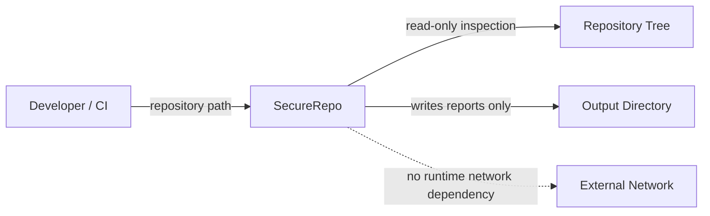
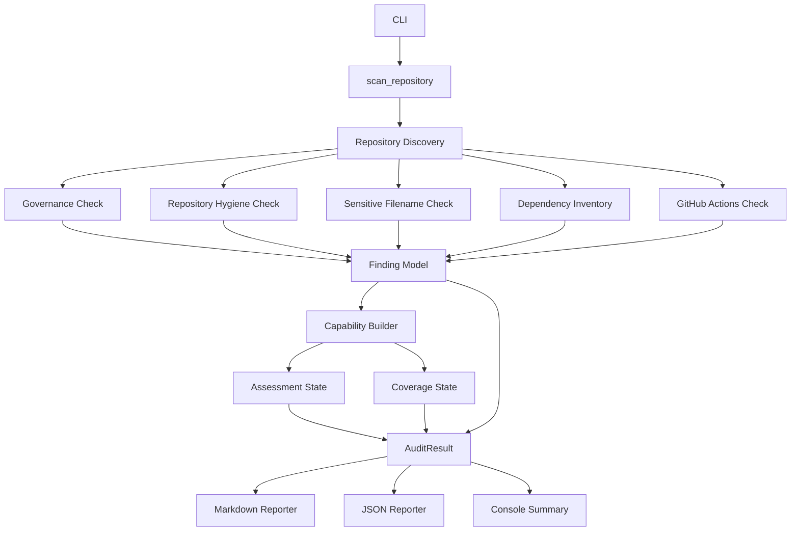
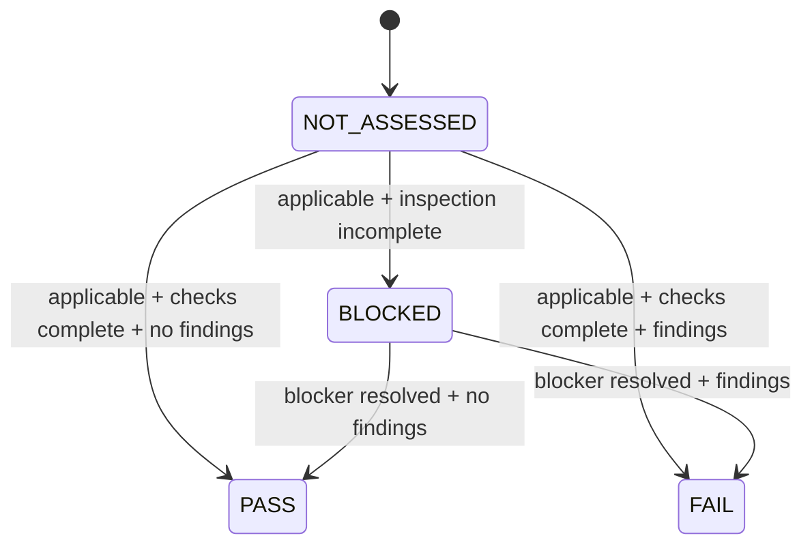

# Architecture

## Purpose

DkWess SecureRepo is a local, evidence-oriented repository auditing toolkit. Its architecture is intentionally small enough to inspect and reason about while preserving clear trust boundaries between repository discovery, checks, evidence modeling, and report generation.

## System context



The dashed network edge represents a non-capability in V0.2: the scanner does not need the network at runtime.

## Internal architecture



## Evidence model

A `Finding` contains:

- stable check ID;
- severity;
- confidence;
- category;
- path/evidence location;
- human-readable detail;
- remediation.

A `CapabilityAssessment` contains:

- capability name;
- assessment state;
- coverage state;
- number of findings;
- notes explaining what the state means.

This separation is deliberate. A repository may have zero findings for a capability while that capability remains `NOT_ASSESSED / UNKNOWN`.

## State model



Coverage is orthogonal:

```text
FULL     implemented checks completed
PARTIAL  implemented checks started but were incomplete
UNKNOWN  no meaningful coverage claim
```

## Trust boundaries

### Repository input

Repository content is untrusted input. SecureRepo must not assume filenames, text encodings, symlinks, workflow syntax, or repository structure are benign.

### Filesystem traversal

V0.2 skips known generated directories and symbolic links during recursive discovery. This reduces accidental traversal outside the intended repository tree.

### Report output

SecureRepo writes only to the configured report directory. It does not rewrite source files, execute repository code, install dependencies, or apply remediations automatically.

### GitHub Actions parsing

The V0.2 analyzer uses conservative line-oriented heuristics. It deliberately does not claim full YAML semantic coverage.

## Dependency policy

Runtime code uses only Python's standard library. Build tooling uses `setuptools`. New runtime dependencies require an explicit architecture and supply-chain review.

## Non-goals in V0.2

- active exploitation;
- malware analysis;
- secret-content scanning;
- package installation;
- dependency CVE lookup;
- full YAML interpretation;
- branch-protection API inspection;
- organization policy inspection;
- automatic remediation;
- network reconnaissance.

## Planned evolution

The architecture reserves future layers for baseline comparison, SARIF output, SBOM generation/validation, provenance, upstream drift, policy evaluation, and release proof.

These features should consume the same evidence model rather than create parallel, incompatible result formats.
