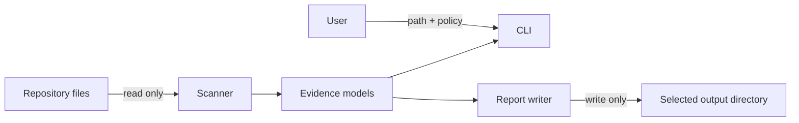

# Architecture

SecureRepo separates discovery, rules, evidence models, reporting and CLI behavior.

```text
src/dkwess_securerepo/
├── __init__.py     public version/API
├── __main__.py     CLI
├── core.py         compatibility facade
├── models.py       findings, capabilities, metrics, audit result
├── rules.py        built-in rule catalog
├── scanner.py      discovery and checks
└── reporting.py    Markdown/JSON output
```

Safe discovery does not follow symlinks, excludes selected generated/vendor directories, counts traversal errors and sorts paths for deterministic behavior.

The rule catalog is the source of truth for built-in ID, category, severity, title, description, remediation and confidence. The CLI uses it for `--list-checks` and `--explain`.

The scanner currently evaluates governance, repository hygiene, sensitive filenames/paths, dependency inventory/selected lockfile hygiene, and GitHub Actions risk patterns.

`models.py` separates findings, capability assessment, coverage and scan metrics. `reporting.py` produces `audit.md` and `audit.json` schema v3.



The current design avoids report timestamps and sorts evidence to improve reproducibility. Finding fingerprints are stable identifiers over rule ID, evidence path and title; they are not repository attestations.

Future scanners can feed the same evidence model for baseline comparison, provenance, SARIF, SBOM and policy evaluation.
