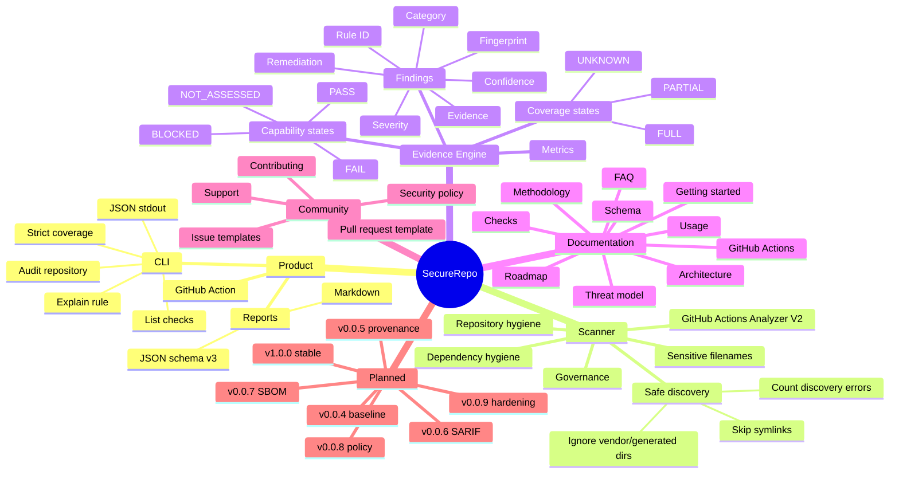
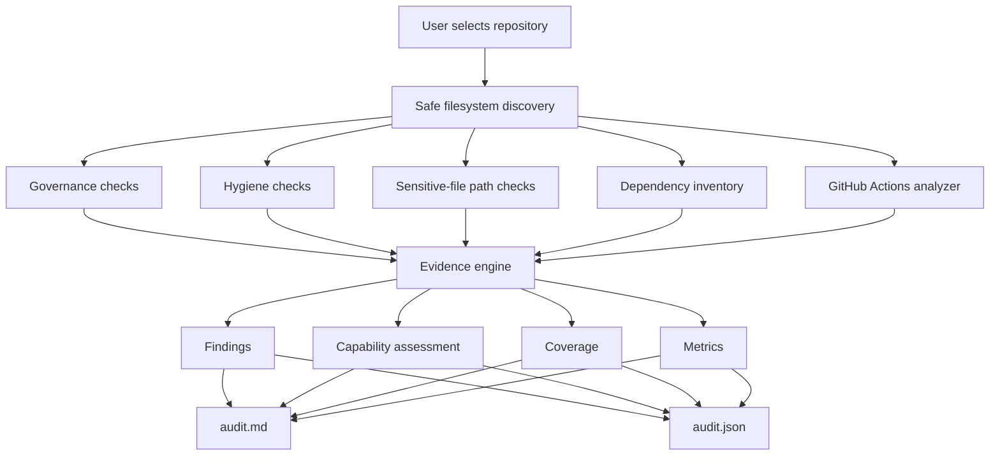

# Project map

```mermaid
mindmap
  root((SecureRepo))
    Product
      CLI
        Audit repository
        List checks
        Explain rule
        JSON stdout
        Strict coverage
      GitHub Action
      Reports
        Markdown
        JSON schema v3
    Scanner
      Safe discovery
        Ignore vendor/generated dirs
        Skip symlinks
        Count discovery errors
      Governance
      Repository hygiene
      Sensitive filenames
      Dependency hygiene
      GitHub Actions Analyzer V2
    Evidence Engine
      Findings
        Rule ID
        Severity
        Confidence
        Category
        Evidence
        Remediation
        Fingerprint
      Capability states
        PASS
        FAIL
        BLOCKED
        NOT_ASSESSED
      Coverage states
        FULL
        PARTIAL
        UNKNOWN
      Metrics
    Documentation
      Getting started
      Usage
      GitHub Actions
      Methodology
      Architecture
      Threat model
      Checks
      Schema
      FAQ
      Roadmap
    Community
      Security policy
      Contributing
      Support
      Issue templates
      Pull request template
    Planned
      v0.0.4 baseline
      v0.0.5 provenance
      v0.0.6 SARIF
      v0.0.7 SBOM
      v0.0.8 policy
      v0.0.9 hardening
      v1.0.0 stable
```

```mermaid
flowchart TD
    A[User selects repository] --> B[Safe filesystem discovery]
    B --> C1[Governance checks]
    B --> C2[Hygiene checks]
    B --> C3[Sensitive-file path checks]
    B --> C4[Dependency inventory]
    B --> C5[GitHub Actions analyzer]
    C1 --> D[Evidence engine]
    C2 --> D
    C3 --> D
    C4 --> D
    C5 --> D
    D --> E1[Findings]
    D --> E2[Capability assessment]
    D --> E3[Coverage]
    D --> E4[Metrics]
    E1 --> F1[audit.md]
    E2 --> F1
    E3 --> F1
    E4 --> F1
    E1 --> F2[audit.json]
    E2 --> F2
    E3 --> F2
    E4 --> F2
```
